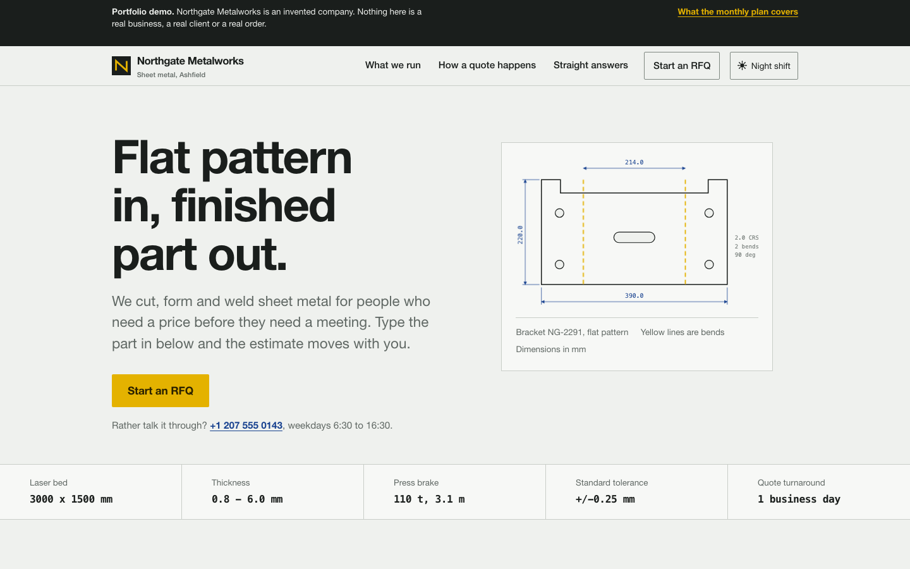
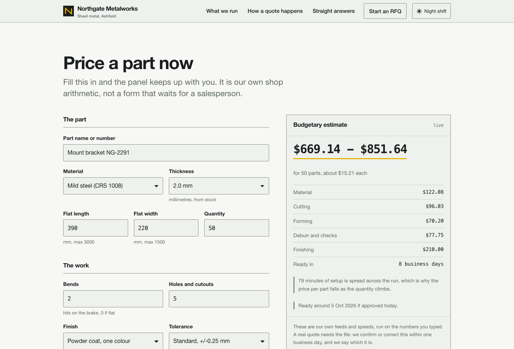
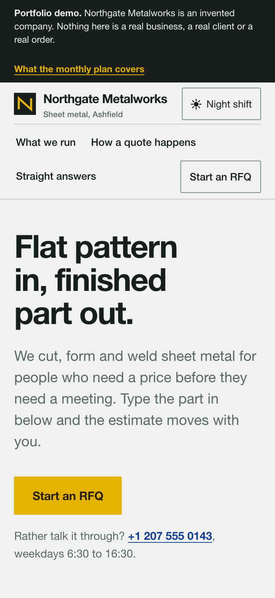

# Northgate Metalworks: business website (demo)

A small business website that does the job a business website is bought for: it turns a visitor
into a request for quote, and it keeps working after launch.



| Live estimate | On a phone |
|---|---|
|  |  |

Northgate Metalworks is an invented company. There are no real clients, orders or certifications
anywhere in these files. This is a demo on made-up data, not client work.

- Live demo: https://flowlab-dev.github.io/demo/business-site/
- Case study: https://flowlab-dev.github.io/work/price-website/

Built by Flow Lab with Claude Code, with the tests below run before every change ships.

## Open it

Double-click `demo/index.html`. That is all: no server, no build step, no internet connection.
Chrome, Safari, Firefox and Edge all work, and so does a phone.

Two pages:

| File | What it is |
|---|---|
| `demo/index.html` | the business site: what the shop does, how a quote happens, the RFQ form, straight answers |
| `demo/after-launch.html` | what the monthly plan covers once a site is live, and what it does not |

## What it does

**A quote form that answers back.** Type a part in (material, thickness, flat size, quantity,
bends, holes, finish, tolerance) and the panel on the right prices it while you type: a range,
a price per part, a cost breakdown and a lead time in business days. Ask for a date inside the
normal lead time and it adds the rush surcharge and says so.

**Checks that read like a person wrote them.** Empty or impossible fields are refused with a
sentence that says what to do: "We stock Mild steel (CRS 1008) in 0.8, 1, 1.2, 1.5, 2, 2.5, 3, 4,
5, 6 mm", not "invalid input". The first field to fix gets the cursor.

**An RFQ you can actually send.** On submit the page builds a reference number and a plain-text
request, and offers two buttons: open it in your email program, or copy it. A demo page has no
server behind it, so it says exactly that instead of pretending the message was sent.

**Both themes.** Light by default, a night-shift palette for dark mode, and a switch in the
masthead that remembers the choice on that device.

## How the price is worked out

All of it lives in `demo/assets/quote.js`, in the open, with the assumptions named:
material density and price per kilo, cutting feed rate by thickness, pierce time, brake time
per hit, setup minutes, inspection, finishing rates and lot minimums, margin, and a published
spread of plus or minus 12 percent. Change a rate in that file and the page and the tests both
follow it, because there is only one copy.

## Tests

```
npm test
```

79 checks, no packages to install:

- `tests/validate.test.js`: what the form accepts and what it says when it does not
- `tests/estimate.test.js`: the arithmetic: setup spread over quantity, material and thickness
  effects, lot minimums, lead times, weekends, rush
- `tests/rfq.test.js`: the reference number and the plain-text RFQ
- `tests/page.test.js`: the pages themselves: no external requests, every link lands, every
  field has a label, the numbers in the copy match the engine, headings in order, both themes
  define the same tokens
- `tests/browser.test.mjs`: the page driven in a real (headless) Chrome: console clean, form
  refuses an empty submit, a full RFQ produces a reference, a finished RFQ retires as soon as the
  numbers change, theme switch works, nothing scrolls sideways at 375 pixels, tap targets are at
  least 44 pixels. Needs Chrome; set `CHROME_PATH` if it lives somewhere unusual, and the set
  skips itself if Chrome is not there

Screenshots are taken the same way:

```
node screenshots/take.mjs
```

## If this were your site

Two things change: the RFQ goes to a real inbox (and, if you want, to a job board or CRM), and
the shop data (rates, materials, lead times) comes out of `quote.js` into somewhere you can
edit without touching code. Everything else on the page is already what you would ship.

## A site like this for your business

Write to trading.flowlab@gmail.com or @flowlabdev on Telegram with what you sell and how quotes happen now. I will tell you what it takes and whether a smaller first version would do.

## License

MIT
